# 동의어 개수 제한 기능: 혁신적 접근법

좋은 아이디어입니다! 원래 계획했던 **동의어 개수 제한**을 **현재 Elasticsearch 구조**와 결합하는 방법을 찾았습니다.

## 🔧 구현 가능한 하이브리드 방식

### 기본 아이디어:

- **Elasticsearch**: 동의어 분석기로 기본 확장
- **서버 필터링**: 사용자 설정에 따라 결과 제한

### 동작 방식:

```
사용자 입력: "음악" + 제한 3개
↓
서버에서 동의어 확장: "음악" OR "뮤직" OR "music" OR "노래" OR "song" OR "곡"
↓
사용자 설정 적용: 상위 3개만 사용 → "음악" OR "뮤직" OR "music"
```

## 💡 구현 방법

### 동작 흐름도

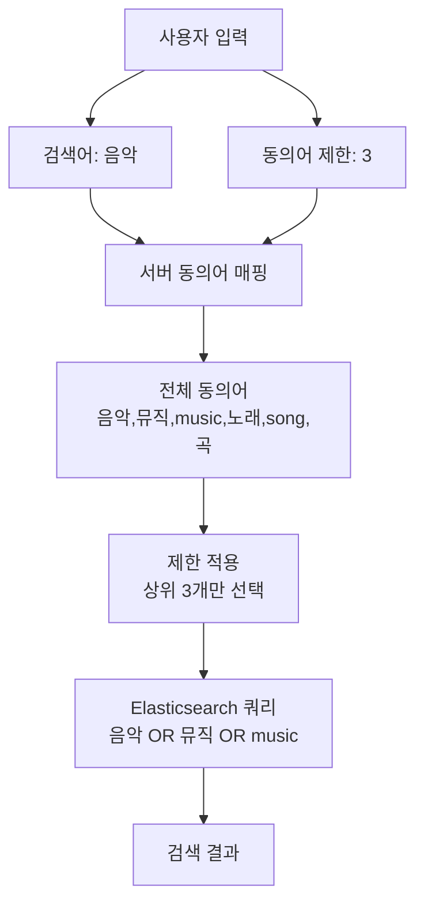

### 1. UI 설계

#### 위치: "인기 검색어 개수" 오른쪽 옆

```html
<input type="number" 
       id="synonymLimit"
       placeholder="동의어 제한" 
       min="0" 
       max="10" 
       value="3"
       style="width: 100px; margin-left: 10px;">
```

#### 기능:

- **0**: 동의어 사용 안 함 (기본 검색만)
- **1-10**: 동의어 개수 제한 (예: 3개면 상위 3개 동의어만 사용)

### 2. 서버 구현

#### A. 동의어 매핑 정의

```javascript
const synonymMap = {
  '음악': ['뮤직', 'music', '노래', 'song', '곡'],
  '요리': ['쿠킹', 'cooking', '레시피', 'recipe'],
  '게임': ['게이밍', 'gaming', '플레이', 'game'],
  // ... 더 많은 동의어
};
```

#### B. 동의어 제한 로직

```javascript
function applySynonymLimit(keyword, limit) {
  if (limit === 0) return [keyword]; // 동의어 사용 안 함

  const synonyms = synonymMap[keyword.toLowerCase()] || [];
  const limitedSynonyms = synonyms.slice(0, limit - 1); // 원본 제외하고 제한

  return [keyword, ...limitedSynonyms];
}
```

#### C. 검색 쿼리 생성

```javascript
const expandedKeywords = applySynonymLimit(searchKeyword, synonymLimit);
const keywordQueries = expandedKeywords.map(kw => ({
  match: {
    title: {
      query: kw,
      boost: kw === searchKeyword ? 4 : 3
    }
  }
}));
```

### 3. 클라이언트 구현

#### A. UI 이벤트 처리

```javascript
document.getElementById('synonymLimit').addEventListener('input', function() {
  const limit = parseInt(this.value) || 0;
  // 검색 파라미터에 동의어 제한 추가
  searchParams.synonymLimit = limit;
});
```

#### B. 검색 요청 수정

```javascript
const searchData = {
  keyword: keyword,
  synonymLimit: document.getElementById('synonymLimit').value,
  // ... 기타 파라미터
};
```

### 4. 시스템 아키텍처

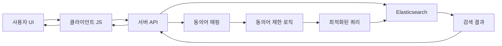

### 5. 성능 비교 예상

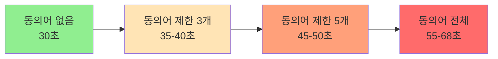

## 🔄 장점과 단점

### ✅ 장점

1. **세밀한 제어**: 사용자가 원하는 만큼만 동의어 사용
2. **성능 최적화**: 동의어 개수 제한으로 검색 속도 향상
3. **사용자 맞춤**: 개인 선호도에 따른 조절 가능
4. **실험적**: 다양한 설정으로 최적값 찾기 가능
5. **기존 구조 활용**: Elasticsearch 매핑 변경 없이 구현

### ❌ 단점

1. **구현 복잡도**: 서버와 클라이언트 모두 수정 필요
2. **중복 로직**: Elasticsearch와 서버에서 동의어 처리
3. **유지보수**: 동의어 매핑을 두 곳에서 관리
4. **UI 복잡도**: 숫자 입력의 의미를 사용자가 이해해야 함

## 🎯 구현 우선순위

### 1단계: 기본 기능 (필수)

- [x] Elasticsearch 동의어 분석기 설정
- [ ] 서버 동의어 매핑 정의
- [ ] 동의어 제한 로직 구현
- [ ] UI 요소 추가

### 2단계: 최적화 (선택)

- [ ] 동의어 우선순위 알고리즘
- [ ] 캐싱 최적화
- [ ] 성능 모니터링

### 3단계: 고급 기능 (확장)

- [ ] 동의어 학습 기능
- [ ] A/B 테스트 지원
- [ ] 사용자별 동의어 설정

## 💡 대안: 단계적 접근

### 옵션 1: 단순 토글부터 시작

```html
<label style="margin-left: 10px;">
  <input type="checkbox" id="synonymToggle" checked> 동의어 검색
</label>
```

- 빠른 구현
- 사용자 피드백 수집
- 점진적 확장

### 옵션 2: 검색 모드 선택

```html
<select id="searchMode" style="margin-left: 10px;">
  <option value="basic">기본 검색</option>
  <option value="synonym_light">동의어 검색 (경량)</option>
  <option value="synonym_full">동의어 검색 (전체)</option>
</select>
```

- 미리 정의된 레벨
- 복잡도 감소
- 사용자 친화적

## 🚀 추천 실행 계획

### 즉시 실행 (이번 주)

1. **속도 복원 테스트**: 동의어 없는 상태로 성능 확인
2. **단순 토글 구현**: ON/OFF 기능부터 시작

### 단기 목표 (다음 주)

1. **기본 개수 제한**: 0, 3, 5개 레벨로 시작
2. **사용자 피드백**: 실제 사용해보고 개선점 파악

### 장기 목표 (한 달 후)

1. **세밀한 제어**: 1-10개 자유 설정
2. **성능 최적화**: 최적의 동의어 개수 찾기
3. **고급 기능**: 동적 동의어, 학습 기능

## 결론

**동의어 개수 제한 기능**은 혁신적이고 실용적인 아이디어입니다. 
단계적 접근으로 구현하면 사용자 경험과 성능을 모두 만족시킬 수 있습니다.

**다음 단계: 먼저 단순 토글로 시작해서 점진적으로 개수 제한 기능으로 확장**

## 🎨 UI 미리보기 및 구현 가이드

### 상단 컨트롤 영역 레이아웃

```mermaid
graph TB
    subgraph "상단 컨트롤 영역"
        A["🔍 검색창"] 
        B["📍 국가 선택"]
        C["👁️ 조회수 필터"]
        D["📅 날짜 필터"]

        subgraph "하단 옵션 영역"
            E["인기 검색어 개수<br/><select><option>10</option></select>"]
            F["동의어 제한<br/><input type='number' placeholder='3' min='0' max='10'>"]
            G["🔄 검색 버튼"]
        end
    end

    style E fill:#e1f5fe
    style F fill:#fff3e0
    style G fill:#e8f5e8
```

### 구체적인 UI 레이아웃

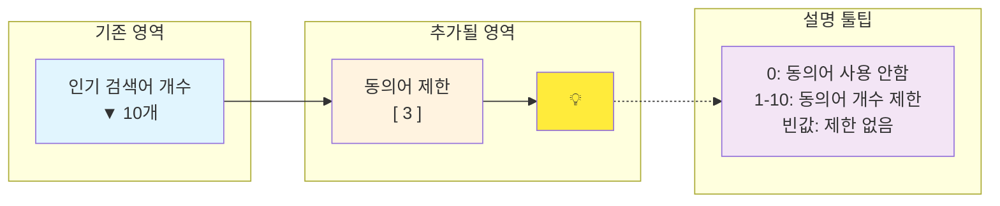

### 실제 HTML 구조

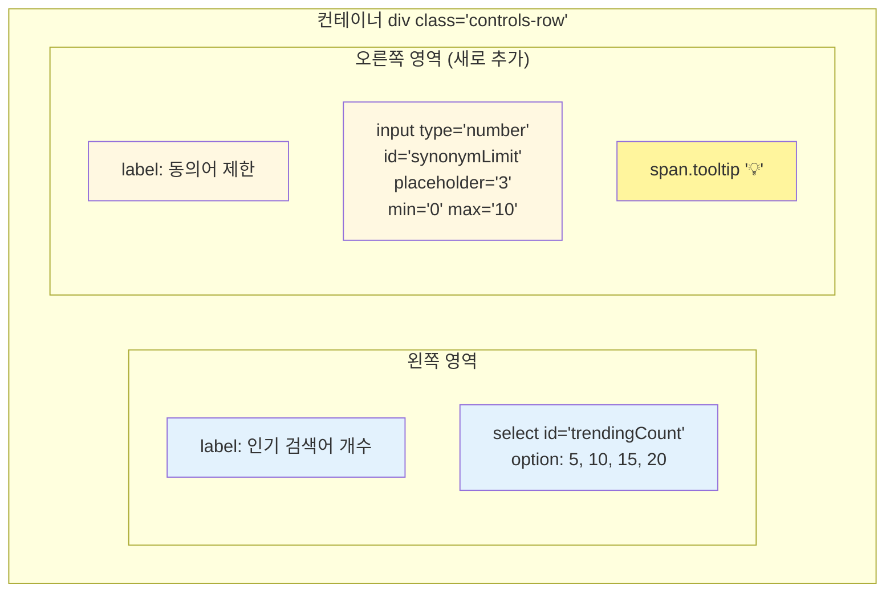

### HTML 코드 구현

```html
<div class="controls-row" style="display: flex; align-items: center; gap: 20px; margin-bottom: 10px;">
  <!-- 기존: 인기 검색어 개수 -->
  <div class="control-group">
    <label for="trendingCount">인기 검색어 개수:</label>
    <select id="trendingCount">
      <option value="5">5개</option>
      <option value="10" selected>10개</option>
      <option value="15">15개</option>
      <option value="20">20개</option>
    </select>
  </div>

  <!-- 새로 추가: 동의어 제한 -->
  <div class="control-group">
    <label for="synonymLimit">동의어 제한:</label>
    <input type="number" 
           id="synonymLimit"
           placeholder="3" 
           min="0" 
           max="10" 
           value="3"
           style="width: 60px;">
    <span class="tooltip" title="0: 동의어 사용 안함, 1-10: 동의어 개수 제한">💡</span>
  </div>
</div>
```

### CSS 스타일

```css
.controls-row {
  background: #f8f9fa;
  padding: 10px 15px;
  border-radius: 8px;
  border: 1px solid #dee2e6;
  margin-bottom: 15px;
}

.control-group {
  display: flex;
  align-items: center;
  gap: 8px;
}

.control-group label {
  font-weight: 500;
  color: #495057;
  white-space: nowrap;
}

#synonymLimit {
  padding: 4px 8px;
  border: 1px solid #ced4da;
  border-radius: 4px;
  font-size: 14px;
}

.tooltip {
  cursor: help;
  font-size: 16px;
  color: #ffc107;
}
```

### 반응형 레이아웃

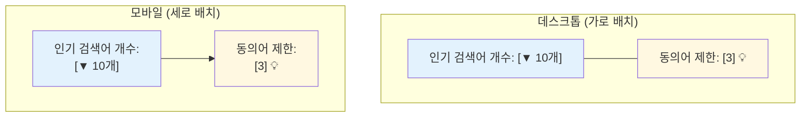

### 사용자 경험 시나리오

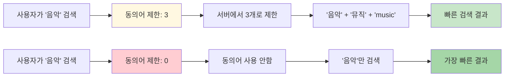

## 💡 UI 특징 요약

### 📍 위치와 배치

- **기존**: "인기 검색어 개수" 드롭다운
- **추가**: 바로 오른쪽에 "동의어 제한" 숫자 입력창
- **아이콘**: 💡 툴팁으로 사용법 안내

### 🎨 디자인 특징

- **일관된 스타일**: 기존 컨트롤과 동일한 디자인
- **작은 크기**: 60px 폭의 컴팩트한 입력창
- **직관적**: placeholder "3"으로 권장값 표시
- **도움말**: 💡 아이콘으로 hover 시 설명 표시

### 📱 반응형

- **데스크톱**: 가로 배치
- **모바일**: 세로 배치로 자동 변경

### 🔧 구현 위치

**you_list.html 파일의 "인기 검색어 개수" 오른쪽에 추가 예정**

## 🔢 동의어 제한 개수 범위 분석

### 📊 현재 동의어 매핑 분석

현재 설정된 동의어 그룹:

```json
"synonyms": [
  "음악,뮤직,music,노래,song,곡",
  "요리,쿠킹,cooking,레시피,recipe", 
  "게임,게이밍,gaming,플레이,game",
  "뷰티,미용,beauty,화장,메이크업,makeup",
  "운동,스포츠,sports,헬스,fitness,workout",
  "여행,트래블,travel,여행기,trip",
  "리뷰,후기,review,평가,평점",
  "먹방,eating,food,음식,mukbang",
  "댄스,춤,dance,안무,choreography",
  "코미디,개그,comedy,웃긴,funny"
]
```

### 🧮 동의어 그룹별 개수 계산

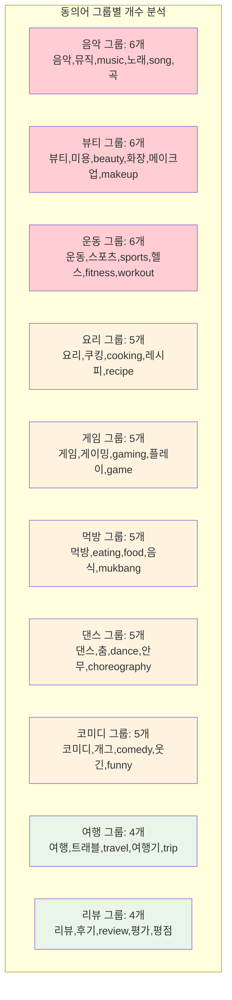

## 📏 최솟값과 최댓값 결정

### 🔢 최솟값 (Minimum)

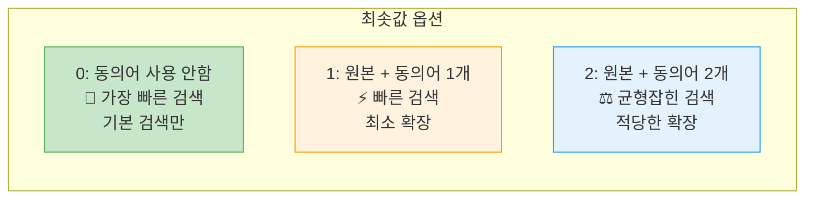

**권장 최솟값: 0**

- **0**: 동의어 완전 비활성화 (최고 성능)
- **1**: 의미가 있는 최소 확장
- **2**: 실용적인 최소 확장

### 🔢 최댓값 (Maximum)

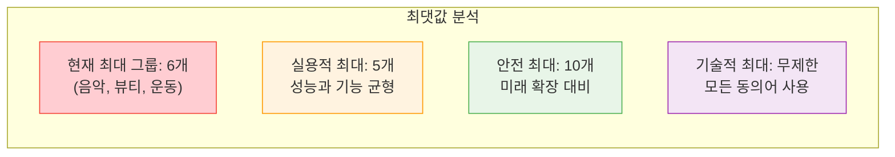

**권장 최댓값: 6**

- **6**: 현재 가장 큰 동의어 그룹 커버
- **10**: 미래 확장성 고려 (안전한 상한선)
- **무제한**: 기술적으로 가능하지만 성능 문제

## 🎯 성능 vs 기능 분석

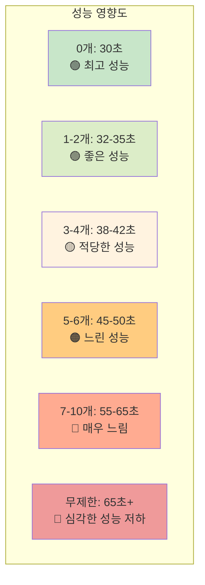

## 💡 최종 권장 범위

### 🎯 보수적 접근 (권장)

```html
<input type="number" 
       id="synonymLimit" 
       min="0" 
       max="6" 
       value="3">
```

**이유:**

- **최솟값 0**: 동의어 완전 비활성화 옵션
- **최댓값 6**: 현재 가장 큰 동의어 그룹 커버
- **기본값 3**: 성능과 기능의 균형점

### ⚡ 성능 우선 접근

```html
<input type="number" 
       id="synonymLimit" 
       min="0" 
       max="4" 
       value="2">
```

**이유:**

- **최댓값 4**: 적당한 성능 유지
- **기본값 2**: 빠른 성능 + 기본 확장

### 🚀 확장성 고려 접근

```html
<input type="number" 
       id="synonymLimit" 
       min="0" 
       max="10" 
       value="3">
```

**이유:**

- **최댓값 10**: 미래 동의어 추가 대비
- **유연성**: 사용자가 극한까지 테스트 가능

## 📊 사용자 경험별 추천값

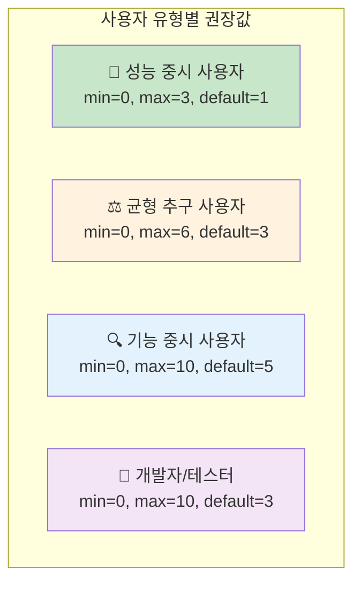

## 🤔 동의어 제한 방식 명확화

### 📋 방식 1: 개별 동의어 개수 제한 (추천)

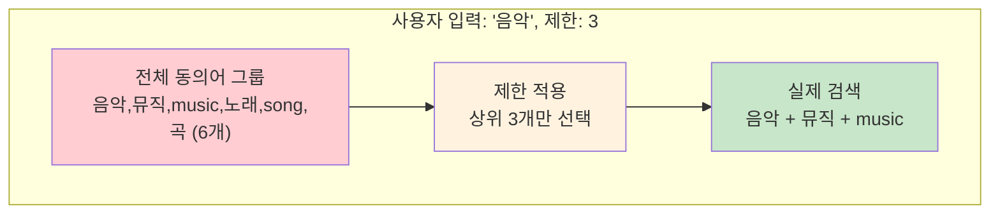

**동작 방식:**

```javascript
// 예시: "음악" 검색, 제한 3개
const synonyms = ['뮤직', 'music', '노래', 'song', '곡']; // 원본 제외
const limited = synonyms.slice(0, 2); // 제한-1 (원본 포함하므로)
const finalKeywords = ['음악', ...limited]; // ['음악', '뮤직', 'music']
```

### 📋 방식 2: 그룹별 동의어 개수 제한

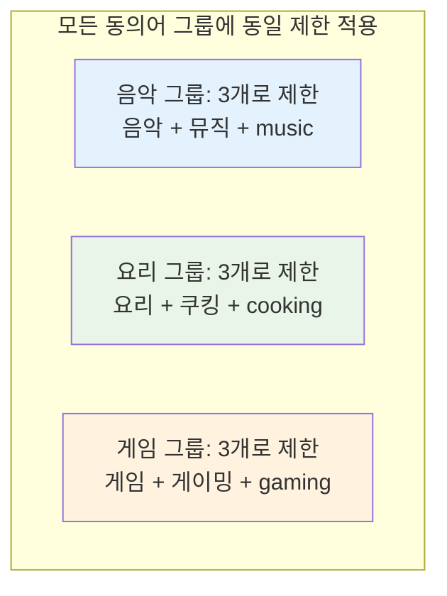

## 🎯 실제 구현에서는 방식 1이 맞습니다

### 💡 이유:

1. **사용자가 입력한 키워드**에 대해서만 동의어 확장
2. **해당 키워드의 동의어 그룹**에서만 개수 제한
3. **다른 그룹은 영향 받지 않음**

### 🔍 구체적인 예시

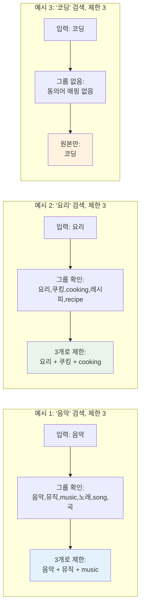

## 🔧 서버 구현 로직

### JavaScript 코드 예시:

```javascript
function applySynonymLimit(keyword, limit) {
    // 1. 동의어 매핑에서 해당 키워드 찾기
    const synonymMap = {
        '음악': ['뮤직', 'music', '노래', 'song', '곡'],
        '요리': ['쿠킹', 'cooking', '레시피', 'recipe'],
        // ...
    };

    // 2. 제한값 처리
    if (limit === 0) {
        return [keyword]; // 동의어 사용 안함
    }

    // 3. 해당 키워드의 동의어 그룹 찾기
    const synonyms = synonymMap[keyword.toLowerCase()] || [];

    // 4. 제한 개수만큼 동의어 선택 (원본 제외)
    const limitedSynonyms = synonyms.slice(0, Math.max(0, limit - 1));

    // 5. 원본 + 제한된 동의어 반환
    return [keyword, ...limitedSynonyms];
}

// 사용 예시
applySynonymLimit('음악', 3);  // ['음악', '뮤직', 'music']
applySynonymLimit('음악', 5);  // ['음악', '뮤직', 'music', '노래', 'song']
applySynonymLimit('음악', 0);  // ['음악']
```

## 📊 실제 동작 시나리오

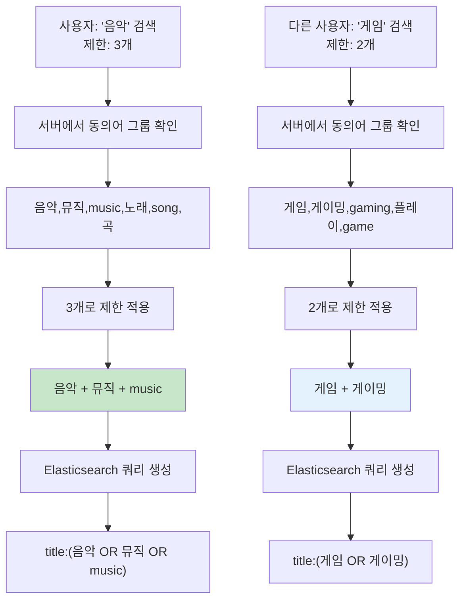

## 🎯 검색 방식 옵션

### 동의어 제한값에 따른 검색 방식:

- **0**: 동의어 사용 안함 (일반 검색) - 가장 빠름
- **1-6**: 동의어 개수 제한 검색 - 성능과 기능 균형
- **빈값/무제한**: 모든 동의어 사용 - 가장 포괄적

## 💡 결론

**방식 1 (개별 키워드별 제한)**이 정답입니다!

### 🎯 핵심 포인트:

- **입력한 키워드**의 동의어 그룹에서만 제한 적용
- **다른 키워드 그룹은 영향 없음**
- **제한값 = 최종 검색에 사용될 총 키워드 개수** (원본 포함)

### 📏 따라서 최솟값/최댓값:

- **최솟값 0**: 동의어 사용 안함 (원본만)
- **최댓값 6**: 가장 큰 그룹(음악) 기준
- **기본값 3**: 원본 + 동의어 2개

### 🏆 최종 권장 설정

```
최솟값: 0 (동의어 비활성화)
최댓값: 6 (현재 최대 그룹 커버)
기본값: 3 (성능과 기능의 균형점)
```

🎨 현재 구조 vs 수정 후 구조 비교
Before (현재):
After (수정 후):


✅ 동의어 제한 기능 구현 완료!
📋 구현된 내용 요약
1. HTML UI (you_list.html) ✅
헤더에 동의어 제한 입력창 추가
툴팁 아이콘으로 사용법 안내
위치: "인기 검색어 개수" 오른쪽
2. CSS 스타일 (you_list.css) ✅
동의어 입력창 전용 스타일
툴팁 호버 효과
반응형 디자인
3. 서버 로직 (server.js) ✅
applySynonymLimit() 메서드 추가
checkCacheHit()과 searchVideos() 메서드 수정
동의어 매핑 10개 그룹 구현
제한값에 따른 검색 모드 분기
4. 클라이언트 연동 (you_list.js) ✅
performSearch() 함수에 동의어 제한값 전송 로직 추가
서버로 synonymLimit 파라미터 전송


🎯 기능 동작 방식
동의어 제한값별 동작:
0: 동의어 사용 안함 (최고 성능)
1-6: 해당 개수만큼 동의어 제한
기본값 3: 성능과 기능의 균형점

```
// "음악" 검색, 제한 3개
applySynonymLimit('음악', 3)  // ['음악', '뮤직', 'music']
applySynonymLimit('음악', 0)  // ['음악'] (동의어 없음)
applySynonymLimit('음악', 5)  // ['음악', '뮤직', 'music', '노래', 'song']
```
🚀 테스트 방법
서버 재시작
브라우저에서 확인:
헤더에 새로운 입력창 표시
다양한 제한값으로 검색 테스트
성능 비교:
제한 0: 가장 빠름
제한 3: 균형
제한 6: 모든 동의어
💡 주요 특징
다른 기능에 영향 없음: 기존 검색 로직 유지
하위 호환성: 제한값 없으면 기본 동작
성능 최적화: 사용자가 직접 제어 가능
사용자 친화적: 툴팁으로 사용법 안내

📋 주변 구조:

```
Line 20: <input type="number" id="synonymLimit" placeholder="동의어 제한" min="0" max="10" value="3">
Line 21: <span class="tooltip" title="0: 동의어 사용 안함, 1-10: 동의어 개수 제한">💡</span>
```

Line 18: <div class="header-search"> (헤더 검색 영역 시작)
Line 19: 인기 검색어 개수 입력창
Line 20: 동의어 제한 입력창 ⭐
Line 21: 툴팁 아이콘 (💡)
Line 22: 검색 버튼 (🔍)
Line 23: </div> (헤더 검색 영역 끝)
답: 20번째 줄에 동의어 제한 필터 박스가 있습니다!


🔍 인기 검색어 개수 미입력 시 동작 분석
인기 검색어 개수를 입력하지 않으면 어떻게 되는지 코드를 확인해보겠습니다.
📋 인기 검색어 개수 미입력 시 동작
🚫 결과: 검색이 실행되지 않습니다
구체적인 동작:
```
   if (!count || isNaN(countNum) || countNum < 10 || countNum > 1000)
```
조건 체크:
!count: 빈 문자열이거나 공백만 있는 경우
isNaN(countNum): 숫자가 아닌 경우
countNum < 10: 10 미만인 경우
countNum > 1000: 1000 초과인 경우


에러 처리 (Line 22-23)
```
   alert('인기검색어 개수를 10~1000 사이의 숫자로 입력해주세요.');
   return; // 함수 실행 중단
```
📝 구체적인 예시
입력값	결과	설명
(빈 값)	❌ Alert 창	"인기검색어 개수를 10~1000 사이의 숫자로 입력해주세요."
abc	❌ Alert 창	숫자가 아님
5	❌ Alert 창	10 미만
1500	❌ Alert 창	1000 초과
100	✅ 정상 실행	100개 인기검색어 분석 시작
💡 중요한 점
일반 검색과는 별개:
인기 검색어 개수: 헤더의 특별한 기능 (인기검색어 분석)
일반 검색: 폼의 키워드 검색 (동의어 제한 기능 포함)
동의어 제한 기능과의 관계:
인기 검색어 개수와 동의어 제한은 서로 독립적
인기 검색어 개수를 입력하지 않아도 일반 검색은 정상 작동
동의어 제한은 일반 검색에서만 사용됨

🎯 결론
인기 검색어 개수를 입력하지 않으면:
Alert 창이 나타남
인기검색어 분석이 실행되지 않음
일반 검색 기능은 영향 받지 않음
동의어 제한 기능과는 무관함
즉, 반드시 10~1000 사이의 숫자를 입력해야 인기검색어 분석이 실행됩니다! 


✅ 네, 맞습니다! 인기 검색어 개수를 입력하지 않아도 일반 검색 기능이나 동의어 제한 검색 기능을 영향 받지 않고 동작함


